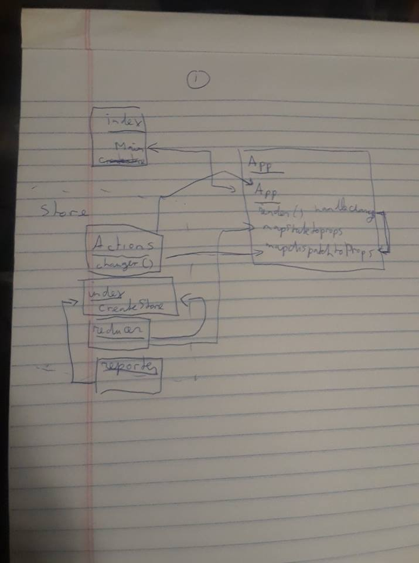
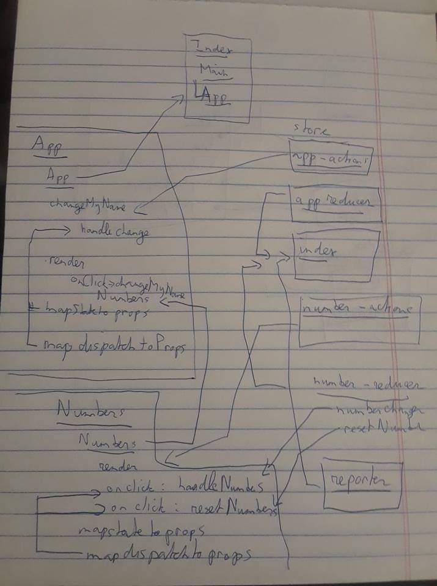

 LAB
=================================================

## Project Name: 
Lab 31 React and Redux

### Author: 
Trevor Stam

### Links and Resources
* [assignment 1](https://codesandbox.io/s/2jqkr1rn5n)
* [assignment 2](https://codesandbox.io/s/km3l2zj2q5)

### Modules Assignment 1
#### `index.js`
##### Exported Values and Methods
`class Main`
#### `App.js`
##### Exported Values and Methods
`class App`
render()
mapStateToProps
mapDispatchToProps
#### `store/actions.js`
##### Exported Values and Methods
`class actions`
changer()
#### `store/index.js`
##### Exported Values and Methods
createStore
#### `store/reducer.js`
`class Main`
#### `middleware/reporter.js`

### Modules Assignment 2
#### `index.js`
##### Exported Values and Methods
`class Main`
#### `app.js`
##### Exported Values and Methods
`class App`
changeMyName
render()
mapStateToProps
mapDispatchToProps --> handleChange
#### `numbers.js`
##### Exported Values and Methods
`class Numbers`
render()
mapStateToProps
mapDispatchToProps --> handleNumbers, resetNumbers
#### `store/index.js`
#### `store/app-actions.js`
#### `store/app-reducer.js`
#### `store/number-actions.js`
#### `store/number-reducer.js`
##### Exported Values and Methods
numberChanger()
resetNumber()
#### `middleware/reporter.js`

#### Tests
No time to do tests

#### UML

